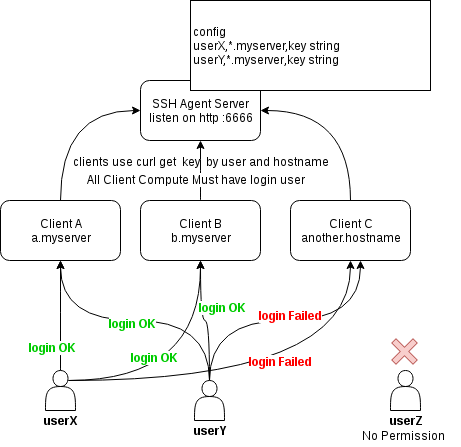

# ssh-agent
Support OpenSSH AuthorizedKeysCommand

### Quick Start

required golang compile enviroment

#### agent-server
```
$ git clone https://github.com/colindev/ssh-agent && cd ssh-agent
$ make
$ sudo make install-agent -e AGENT=[agent listen on]
```

then set ssh key and tag
```
$ vim /etc/ssh-agent-server.conf
```
user,tag1,tag2,key

tag is the client hostname whitch the machine hostname that you want to login via the agent, and you can use `*` to match part of name

#### agent-client
```
$ git clone https://github.com/colindev/ssh-agent && cd ssh-agent
$ sudo make install-authorization -e AGENT=[your agent host:port]
```

### Profile



### References
- [openssh auth](https://blog.heckel.xyz/2015/05/04/openssh-authorizedkeyscommand-with-fingerprint/)
